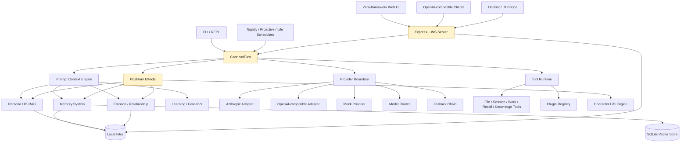
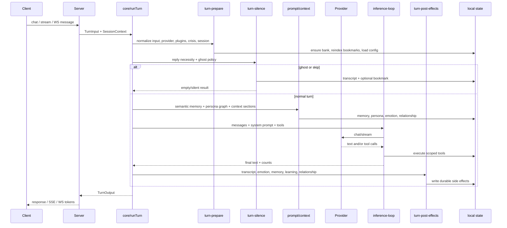
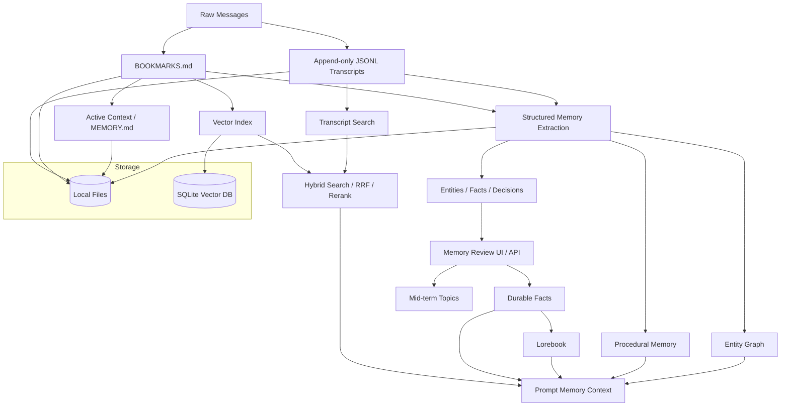
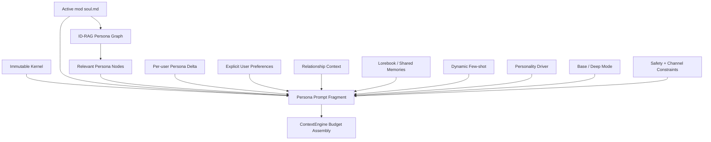
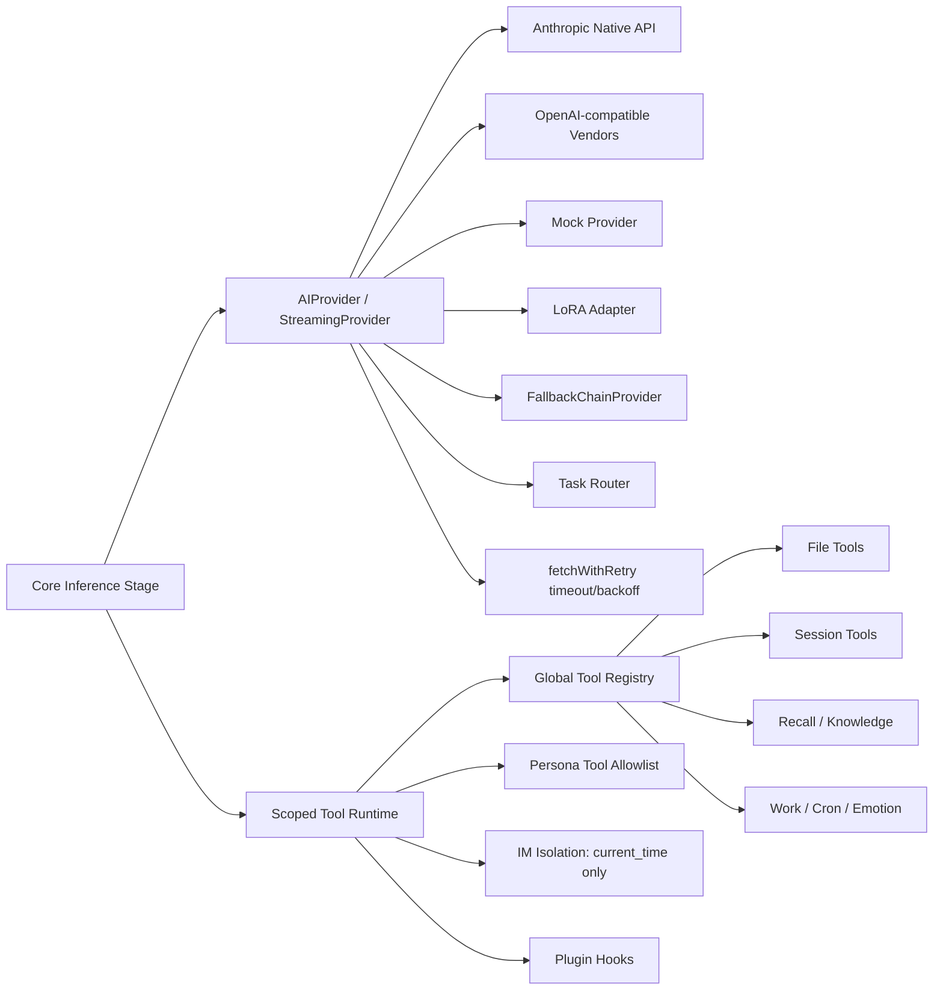
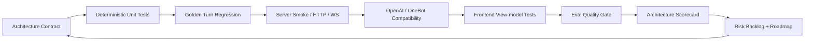

# Mio Architecture Diagrams

These Mermaid diagrams summarize Mio's current architecture as of the research pass in `docs/research/architecture-review-long-task.md`.

Overall verdict: `good, not excellent`.

Use these diagrams for README, papers, or presentations, but keep the hotspot notes. The diagrams describe the current system, not an idealized future state.

## 1. System Overview



Hotspots:

- `src/server/index.ts` is the largest composition root.
- `src/core/agent-loop.ts` still owns prompt/persona/memory context assembly.
- `src/core/turn-post-effects.ts` aggregates many domain side effects.

## 2. Turn Loop



Key design point:

The public `runTurn` pipeline is clearer after the `turn-*` split, but prompt/persona/memory context ownership still needs extraction before the architecture can be called excellent.

## 3. Memory Stack



Strength:

Mio's memory architecture is a product strength because it is layered and reviewable rather than a single chat-history buffer.

Risk:

`structured-memory.ts`, `search.ts`, and `consolidation-phases.ts` are broad files, and multi-file consolidation recovery is not yet proven.

## 4. Persona Stack



Accurate claim:

`soul.md` is the primary character-archetype source. Runtime persona behavior also includes dynamic overlays and code-backed policies.

## 5. Provider And Tool Boundary



Strength:

Provider and tool contracts are compact and pragmatic.

Risk:

Fallback/routing/plugin lifecycle behavior needs direct tests before these boundaries can be described as mature.

## 6. Server Bridge Surface

```mermaid
flowchart TB
  Browser[Web UI] --> Static[Static Web + Assets]
  Browser --> NativeAPI[Native HTTP API]
  Browser --> WS[WebSocket API]
  Browser --> SSE[Native SSE Chat]

  OpenAIClient[OpenAI SDK-compatible Client] --> OpenAIAPI[/v1/chat/completions]
  OneBotClient[OneBot v11] --> OneBotAPI[/onebot/v11/events]
  Admin[Local Admin / Settings] --> AdminAPI[Admin / Backup / Export]
  Studio[Persona Studio] --> PersonaAPI[Mods / Soul / Persona / Character]
  Analytics[Analytics UI] --> AnalyticsAPI[Analytics / Search / Memories]
  Notify[Notification Tests] --> NotifyAPI[Notify Routes]

  NativeAPI --> RunTurn[core/runTurn]
  WS --> RunTurn
  SSE --> RunTurn
  OpenAIAPI --> RunTurn
  OneBotAPI --> RunTurn
  PersonaAPI --> MemoryPersona[Memory + Persona Files]
  AdminAPI --> LocalData[(Local Data Dir)]
  AnalyticsAPI --> LocalData
  NotifyAPI --> External[Telegram / Webhook / Discord / Slack / WeClaw]
```

Strength:

Multiple client protocols route into one agent core, preserving behavior consistency.

Risk:

The route surface is broad but currently concentrated in `src/server/index.ts`. Streaming and WS cancellation do not yet propagate into `runTurn`.

## 7. Evidence Loop



Current test strength:

The suite is broad for a personal agent project.

Current test gap:

Direct tests are missing for plugin lifecycle, provider fallback/routing, ID-RAG retrieval/rendering, native route auth, frontend PWA/dev-server behavior, browser UI workflows, and cancellation semantics.
