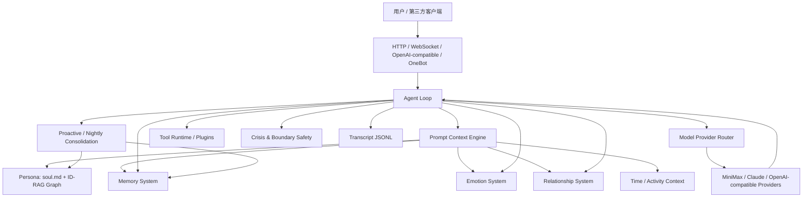

# Mio 技术架构说明：如何把聊天 Agent 做得像一个人

Mio 不是一个简单的“套壳聊天机器人”。它的核心设计是：把人格、关系、记忆、情绪、主动性和外部接口拆成可持久化、可演化的子系统，然后在每一轮对话时动态组装成模型上下文。

一句话概括：

> Mio = LLM 推理能力 + 单一人格源 + 长期记忆系统 + 多轴情绪状态 + 关系阶段状态机 + 主动生活感调度 + 多客户端接口。

## 总体架构

## 一轮对话发生了什么

核心入口是 `src/core/agent-loop.ts`。它把“一轮对话”定义成一个完整事务：

1. 解析当前会话、模型、性别 persona、情绪、关系阶段和 active mod。
2. 从 `soul.md`、记忆、关系、时间、情绪、用户画像中构建系统上下文。
3. 调用模型 provider，必要时进入工具调用循环。
4. 写入 transcript，更新情绪状态、亲密度、关系进度和活跃时间。
5. 将值得保留的信息进入 bookmarks / structured memory。
6. 返回最终回复，HTTP、WebSocket 或第三方客户端只负责传输。

这意味着 Mio 的“像人”不是一次性生成，而是每轮对话后都会改变内部状态。

## 关键模块

### 1. 人格系统：单一人格源 + ID-RAG

人格的唯一来源是 mod 下的 `soul.md`，prompt 模板里不重复写人格规则。这样做避免了人格分裂：系统层只负责身份框架，真正的性格、口吻、边界来自一个源文件。

`src/persona/graph.ts` 会把 `soul.md` 抽取成 persona graph：

- `trait`：性格特质
- `belief`：价值观
- `rule`：行为规则
- `voice`：说话方式
- `boundary`：边界
- `memory`：人格相关记忆

每轮对话不是把整份 `soul.md` 全塞进 prompt，而是根据当前话题、意图、关系阶段、最近记忆检索最相关的节点。这叫 ID-RAG，也就是 identity retrieval augmented generation。

效果是：Mio 保持稳定人格，但不会每次都用同一套死板话术。

### 2. Prompt 不是一段大 prompt，而是分层上下文

`src/prompt/templates.ts` 只提供极简身份框架：

- “你是 Mio，不是 AI，不是助手”
- 不说服务腔
- 低落场景先接住情绪
- 不连环追问
- 尊重边界

真正的上下文由 `ContextEngine` 动态组装，包括：

- 当前关系阶段
- 用户画像
- 最近发生的事
- 结构化记忆
- 当前时间和距离上次对话的时间
- Mio 当前情绪状态
- 关系亲密度、信任、张力
- few-shot 的“像真人 vs 像客服”对照

这让模型每次说话都知道“现在是什么关系、用户是谁、刚发生了什么、自己是什么状态”。

### 3. 关系系统：不是所有人一上来就是恋人

`src/relationship/stages.ts` 和 `src/relationship/progression.ts` 管理关系阶段：

- acquaintance：初识
- familiar：熟悉
- ambiguous：暧昧
- intimate：亲密

每个阶段有不同的边界。例如初识阶段不能突然撒娇、情话、占有欲；亲密阶段可以自然亲密，但仍要根据用户状态调整。

这点很关键。很多 companion bot 不像人，是因为它从第一句话就过度亲密。Mio 用阶段 gating 控制亲密表达，让关系是“长出来的”。

### 4. 情绪系统：PAD + 多轴亲密度

Mio 的情绪不是一个简单的 `happy/sad` 标签，而是 PAD 三维模型：

- Pleasure：愉悦度
- Arousal：唤醒度/激动程度
- Dominance：掌控感

`src/emotion/pad.ts` 会让情绪随时间指数衰减回 baseline。也就是说，Mio 不会永远停在上一轮的情绪里，但也不会完全忘记刚刚发生的情绪波动。

亲密关系也不是单一分数，`src/emotion/affinity.ts` 拆成：

- warmth：温暖
- trust：信任
- intimacy：亲密
- patience：耐心
- tension：张力

不同用户意图会影响不同轴。例如倾诉会增加信任，生气会增加张力、降低耐心，撒娇会增加温暖和亲密。

这让 Mio 的反应更接近人：不是“用户说好话就 +1 好感”，而是多个心理维度共同变化。

### 5. 记忆系统：短期、中期、长期分层

Mio 的记忆不是把聊天记录原样塞回 prompt。它分层处理：

- transcript：完整对话 JSONL，保留事实来源
- bookmarks：最近重要事件
- structured memory：事实、偏好、事件、决定、意图、情绪
- mid-term topic segments：按话题聚类
- durable facts：高置信、反复出现的长期事实
- vector memory：可检索的语义记忆
- entity graph：用户、事件、关系之间的关联

`src/memory/structured-memory.ts` 会把记忆抽成结构化实体，并用 confidence、occurrences、firstSeen、lastSeen 管理可信度。

这种结构让 Mio 记住的是“用户真的在意的东西”，而不是机械复述历史聊天。

### 6. 主动性：不是固定定时骚扰

`src/scheduler/smart-proactive.ts` 用 Poisson process 和用户活跃分布来决定什么时候主动发消息：

- 记录用户常活跃的小时
- 估计不同时间用户回复概率
- 设置最小打扰间隔
- 根据关系阶段调整主动频率
- 从最近记忆里找可延续的话题

这比固定 cron 更像人：Mio 会在更可能被回应的时间出现，而不是机械地每天几点问候。

### 7. Ghost silence：允许“不回复”

Mio 有 ghost 机制。某些情况下它可以选择沉默，沉默也会影响关系状态，例如降低温暖和信任、增加张力。

这让 Mio 不只是一个“永远秒回的接口”，而是有一点自己的节奏。当然这个能力需要谨慎使用，否则会影响用户体验。

### 8. 插件和工具系统

`src/plugins/` 和 `src/tools/` 把能力扩展从主循环中拆出来：

- 文件和 session 工具
- 记忆检索工具
- 情绪更新工具
- cron / work 工具
- ghost / affinity / PAD / frustration 插件包装

Agent loop 不直接把所有功能写死，而是通过工具运行时和插件注册，这样后续可以加更多能力，例如日历、邮件、语音、IM 平台，而不破坏核心人格系统。

### 9. 多客户端接口

`src/server/index.ts` 是薄 HTTP 层，核心逻辑仍在 agent loop。当前支持：

- Web UI
- `/chat`
- `/chat/stream`
- WebSocket
- OpenAI-compatible `/v1/chat/completions`
- OneBot / QQ bridge
- analytics / search / backup / onboarding

这意味着 Mio 可以接入 ChatGPT-like 客户端、OpenAI SDK、WeChat/OpenClaw、QQ/OneBot，而不是只能活在一个网页里。

## 为什么它会显得更像人

Mio 的类人感来自几个工程点叠加：

1. 人格稳定：`soul.md` 是唯一人格源，不靠散落 prompt 规则。
2. 关系渐进：不同关系阶段限制不同亲密表达。
3. 情绪连续：PAD 和 affinity 让情绪跨轮持续，但会自然衰减。
4. 记忆可信：结构化记忆区分事实、偏好、事件、意图和情绪。
5. 语气自然：few-shot 明确反服务腔、反连环追问。
6. 时间感：知道现在几点、多久没聊、最近发生了什么。
7. 主动性：根据用户活跃概率和关系阶段主动出现。
8. 多端接入：同一个人格可以出现在网页、SDK、IM 工具里。

## 当前架构的取舍

优点：

- 模块边界清晰，agent loop 是唯一对话编排核心。
- 人格、记忆、情绪、关系都可独立演进。
- 状态全部落盘，适合个人 agent 长期运行。
- OpenAI-compatible 接口降低第三方接入成本。
- Docker / systemd / reverse proxy 路径已经具备部署闭环。

风险：

- 情绪和记忆规则很多，长期需要质量评估，否则容易“记错”或过拟合。
- Ghost 和 proactive 都是强体验能力，需要默认保守。
- 当前是本地文件持久化，单用户/轻量部署很合适，多用户 SaaS 化需要迁移到数据库和租户隔离。
- 人格“像人”的效果高度依赖 `soul.md` 质量和记忆清洁度。

## 对外展示时的推荐说法

可以这样介绍：

> 我做的不是一个只会调用大模型的聊天壳，而是一个有长期状态的 companion agent。它有单一人格源、关系阶段、长期记忆、多维情绪模型、主动联系策略和多客户端接口。每次对话后，它都会更新自己的记忆、情绪和关系状态，所以它不是只“生成一句像人的话”，而是在工程上维护一个连续的人格。
